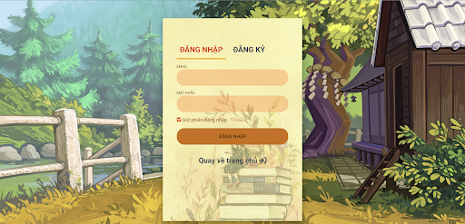
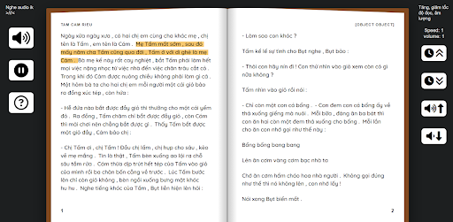
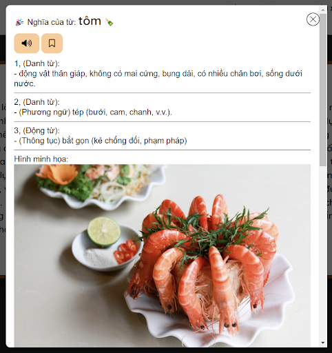
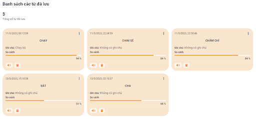
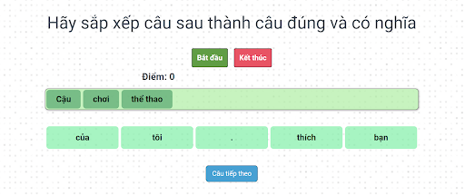
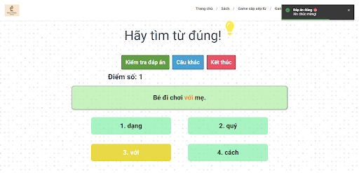

# **Story Time For Kit** 
&ensp;&thinsp;&ensp;&thinsp;Learning with young children is a very important process for helping children develop and learn important life skills. Usually, the learning process in school is enough for children to develop some skills such as communication, reading and speaking. However, at home, young children can still learn through many forms. One of them could be through books, or playing some games. However, reading a book can quickly get bored and not arouse much interest. Today, children tend to learn and entertain through electronic devices, not simply through books that can make them feel dry. The application was born to help young children feel more interested in reading. Through the application, young children can listen to useful stories, taking notes of the words they learn through stories. Moreover, young children can also learn Vietnamese sentences through built-in games.
 
 
&ensp;&thinsp;&ensp;&thinsp;What the application can do is not only aimed at normal children but also partly with children with dyslexia. Often with these children, one of the effective methods is to strengthen the reading training process that incorporates the senses such as listening, reading, taking notes and practicing through games. Therefore, the application targets a part of children with dyslexia through a combination of reading, listening and noting new words. When the book is read, the sentences being read will be highlighted, thereby helping to combine sight, hearing and mental recitation, thereby partly helping to improve dyslexia. Furthermore, through games such as arranging sentences, choosing the right words can help children learn how to connect words into sentences. which can help improve reading.
 
 
&ensp;&thinsp;&ensp;&thinsp;However, the application may not have integrated functions that are comprehensive for all groups of children. For groups of children with dyslexia, there can be many different manifestations and different ways of improving. As a result, the app's functions may not be effective for particular groups of children with reading difficulties. The application's job is to provide a means to help children get excited about reading through useful stories and games to help practice words, more deeply towards children who have difficulty reading through matching. integrate the skills of listening, seeing, reading, and taking notes.

## What this project does?
> This is the backend side, providing APIs for the frontend of the application. Some apis include login, register, add book, convert text to speech, ... for the purpose of the application
 
 
> **You maybe need to see the frontend side:** [HMI-frontend](https://github.com/manhhungpc/HMI-frontend)

## Some pictures of application
1. Login UI  
   
 
2. Register UI  
   
 
3. Read book UI  
   
 
4. Note UI  
   
 
5. Review words noted UI  
   
 
6. Game UI  
   
 
   

## Technologies used
### 1.ExpressJS
> A library for designing backend APIs. We use this library to provide the apis for the frontend side of application
### 2.MongoDB
> We use MongoDB database to store the data used in the application
### 2.Svelte
> We use Svelte for developing frontend side of application.  
> **You maybe need to see the frontend side**: [HMI-frontend](https://github.com/manhhungpc/HMI-frontend)